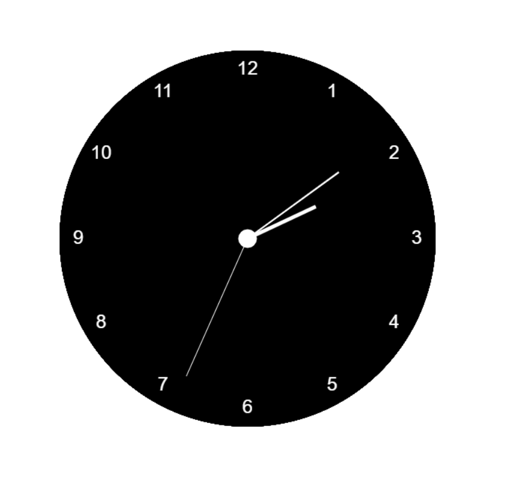

# Analog-Clock-using-Canvas-and-JS
This project is to design a running Analog clock using HTML5 canvas and JavasScript.

<h2>Application</h2>

<h2>In action </h2>

 see this application in action <a href="http://jayasampathwebhosting-com.stackstaging.com/projects/canvas-clock/">here </a>

